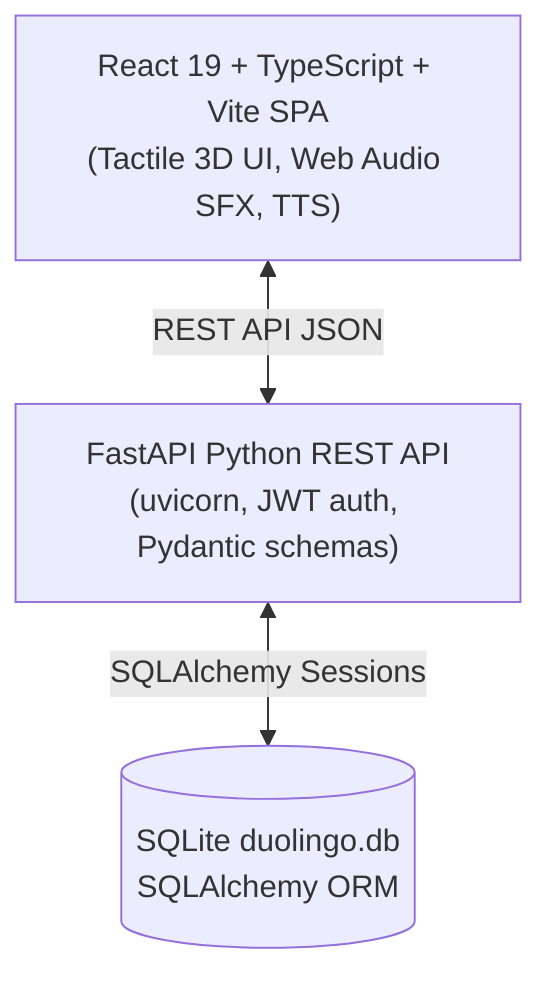
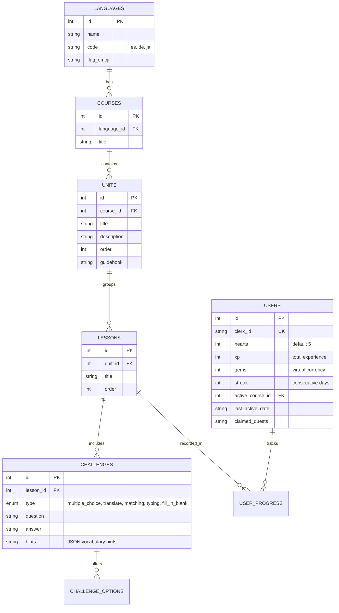

# 🦉 Duolingo Web App — SDE Fullstack Assignment

> A high-fidelity, playful, and responsive web clone of Duolingo replicating the original app's visual design, interactive lesson loop, and gamification mechanics.

---

## 🌟 Overview

This project implements the core Duolingo web application experience, featuring:
- **Sinuous Learning Path / Skill Tree**: Unlocking progression, unit headers, guidebook modals, active node progress rings, and locked/completed states.
- **5 Interactive Exercise Types in Lesson Player**:
  1. 🔤 **Translate This Sentence** (Interactive word bank / tap-the-words + keyboard input)
  2. 🔘 **Multiple Choice** (Tactile answer cards)
  3. 🧩 **Match Pairs** (Dual-column word pairing with live matching feedback)
  4. 📝 **Fill-in-the-Blank (Cloze)** (Sentence with interactive blank slot and word tiles)
  5. ⌨️ **Type the Answer** (Free-form typing with accent-insensitive tolerance)
- **Gamification Engine**:
  - **Hearts Loop**: Lose 1 heart on wrong answers; triggers the signature **"Out of Hearts" Modal** offering practice recharges or gem refills.
  - **Daily Streaks**: Streak counter tracking active daily practice.
  - **Leagues Leaderboard**: Tiered leagues (Bronze, Silver, Gold, Diamond) with promotion zones and seeded learners.
  - **Daily Quests**: Claimable daily goals rewarding XP and Gems.
  - **Gem Bazaar / Shop**: Streak freezes and heart refills.
  - **Achievements & Badges**: Visual milestones on Profile (*Wildfire*, *Sage*, *Scholar*, *Champion*).
- **Multi-Language Curriculum**: Pre-seeded with **Spanish 🇪🇸**, **German 🇩🇪**, **Japanese 🇯🇵** (Hiragana/Katakana non-Latin script support), and **French 🇫🇷** (accent support, elision, Parisian dialogue).

---

## 🏗️ Architecture & Tech Stack



### Why React + Vite SPA?
1. **Low-Latency Game Loop**: Duolingo is fundamentally a stateful, interactive web game with immediate sound effects (`Web Audio API`), speech synthesis (`Web Speech API`), drag/tap animations, and confetti particle bursts (`canvas-confetti`).
2. **Instant Hot Module Replacement & Build**: Sub-second compilation without hydration mismatches.
3. **Clean Decoupled Architecture**: 100% separation between the interactive frontend client and the Python FastAPI REST backend.

---

## 🗄️ Database Schema (SQLite)

The relational schema is built with SQLAlchemy in `backend/models.py`:



---

## 🚀 Getting Started

### Prerequisites
- **Node.js**: v18+ (v20+ recommended)
- **Python**: v3.10+ (v3.12 recommended)
- **npm** or **pnpm**

### 1. Backend Setup (FastAPI + SQLite)

```bash
# Navigate to project root
cd "Duolingo Clone"

# Create and activate virtual environment (optional but recommended)
python -m venv venv
# Windows:
.\venv\Scripts\activate
# Linux/macOS:
source venv/bin/activate

# Install dependencies
pip install fastapi uvicorn sqlalchemy pydantic pyjwt

# Seed database with courses, units, lessons, and challenges
python -m backend.seed

# Start the FastAPI server
uvicorn backend.main:app --port 8000
```
Backend runs on: `http://localhost:8000`  
API Swagger Docs: `http://localhost:8000/docs`

---

### 2. Frontend Setup (React + Vite)

```bash
# Install frontend dependencies
npm install

# Start Vite dev server
npm run dev
```
Frontend runs on: `http://localhost:5173`

---

## 📡 API Overview

| Method | Endpoint | Description |
| :--- | :--- | :--- |
| `GET` | `/api/user` | Fetches learner profile, hearts, gems, streak, and XP |
| `PUT` | `/api/user` | Syncs updated user state |
| `GET` | `/api/courses` | Lists all available language courses |
| `POST` | `/api/user/course` | Switches learner's active language course |
| `GET` | `/api/units` | Returns learning path units, lessons, and lock/unlock progression |
| `GET` | `/api/lessons/{id}` | Fetches lesson challenges, word banks, and hints |
| `POST` | `/api/lessons/{id}/complete` | Awards XP, Gems, updates streak, and records progress |
| `GET` | `/api/practice` | Generates a practice workout session |
| `POST` | `/api/practice/complete` | Recharges vitality (+1 Heart, +10 XP) |
| `GET` | `/api/quests` | Retrieves daily quests and claim states |
| `POST` | `/api/quests/{id}/claim` | Claims completed quest rewards |
| `GET` | `/api/leaderboard` | Returns league standings and user rank |
| `POST` | `/api/user/simulate-day` | Simulates day progression (`days_ago=1`) for testing daily streaks |

---

## 💡 Key Design Decisions & Features

1. **Top Bar & Gamification Stats**:
   - Displays real-time **Streak (🔥)**, **XP (⚡)**, **Gems (💎)**, and **Hearts (❤️)** across the entire application header.
2. **True Hearts Mechanic**:
   - Wrong guesses decrease hearts (`5 -> 4 -> 3 -> 2 -> 1 -> 0`).
   - If hearts drop to 0, the signature **"Out of Hearts" Modal** prevents progress until the learner recharges via `/practice` or refills using 50 Gems.
   - Successful lesson completions reward XP & Gems without penalizing hearts.
3. **5 Distinct Exercise Types**:
   - **Translate This Sentence**: Word bank / tap-the-words + keyboard toggle.
   - **Multiple Choice**: Tactile answer cards with instant feedback.
   - **Matching Pairs**: Synchronized 2-column grid tracks with Romaji guides and animations.
   - **Fill-in-the-Blank (Cloze)**: Interactive sentence slot with options.
   - **Type the Answer**: Free-form input with live Hiragana typing helper for Japanese.
4. **Accent & Diacritic Tolerance**:
   - Typing `el nino` for `el niño` passes with an educational nudge: `💡 Pay attention to accents: el niño`.
5. **Speech Audio & Native Pronunciation**:
   - Pronunciation using Web Speech API for Spanish, German, Japanese, and French. Includes normal and turtle (🐢) slow-speed playback.
6. **Settings & Mocked Placeholders**:
   - Preferences for audio, sound effects, and daily XP goals.
   - Placeholders with "Coming Soon" badges for Super Duolingo, Speech Recognition, Dark Mode, and Social Quests.

---

## 📄 License
This project was developed for the SDE Fullstack Assignment.
